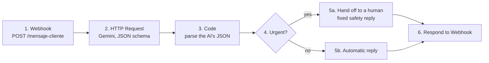

# n8n AI message triage

An [n8n](https://n8n.io) workflow that triages customer messages for a (fictional) air-conditioning business in Mazatlán, *Climas del Pacífico* — the same business used in [DocuCita](https://github.com/Jesus-Jazisenot/docucita).

A message arrives on a webhook → Gemini classifies it with **structured JSON output** (category, urgent or not, draft reply) → an **IF** node routes it: urgent cases (sparks, burning smell, very angry customer) go to a human with a fixed safety message; everything else gets the AI's reply automatically.



## Design choices

- **Structured output instead of free text.** Gemini must answer `{categoria, urgente, respuesta}` with an enum of allowed categories, so the IF node always has a field to read.
- **No invented facts.** The prompt forbids making up prices or dates; the reply says an advisor will confirm them.
- **Human in the loop for risky cases.** Urgent messages never get an AI-written answer: the text is fixed by the business.
- **Plain HTTP Request node.** Any LLM API can be swapped in by changing the URL; the node retries 3× on errors (the free tier returns 503s often).
- **No secrets in the workflow.** The API key and model come from environment variables (`$env.GEMINI_API_KEY`, `$env.GEMINI_MODEL`).

## Results (n8n 2.40.7, `gemini-flash-lite-latest`)

| Message | Category | Urgent | Route |
|---|---|---|---|
| "¿Cuánto cuesta instalar un minisplit de 1 tonelada?" | cotizacion | no | automatic reply (no price invented) |
| "El clima está echando chispas y huele a quemado!!" | garantia | **yes** | hand off to a human |
| "Quiero agendar una limpieza para mis 2 minisplits" | mantenimiento | no | automatic reply |

## Run it

Requires Docker and a Gemini API key.

```powershell
.\iniciar_n8n.ps1          # starts n8n on http://localhost:5678 (reads GEMINI_API_KEY from ..\docucita\.env)
docker cp clasificador_mensajes.json n8n:/tmp/flujo.json
docker exec n8n n8n import:workflow --input=/tmp/flujo.json
docker exec n8n n8n publish:workflow --id=ClasificadorIA01
docker restart n8n
.\probar.ps1               # sends the 3 sample messages
```

Or import `clasificador_mensajes.json` from the n8n editor and toggle it active. Change the key's source in `iniciar_n8n.ps1` if you don't have DocuCita next to this folder.

## Guide (Spanish)

[`GUIA.md`](GUIA.md) / [`docs/Guia-n8n-Clasificador.pdf`](docs/Guia-n8n-Clasificador.pdf) explains every node and why it's built that way, the problems found while setting it up, and how to present it in an interview.
